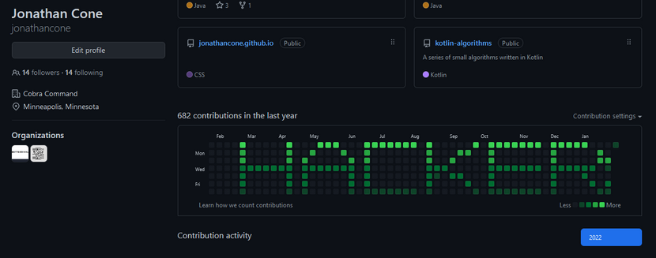

Pyleup
======

"Pile up" your commits with this Python script.

How to use this:
1. Fork this repo
2. Open up pyleup.py and edit the message template to your liking
3. Optionally update the commit message
4. Run the script
5. Copy and paste the output into your shell for the project
6. Perform a `git push` and visit your profile page
7. Repeat as desired to alter the intensity of the commits

